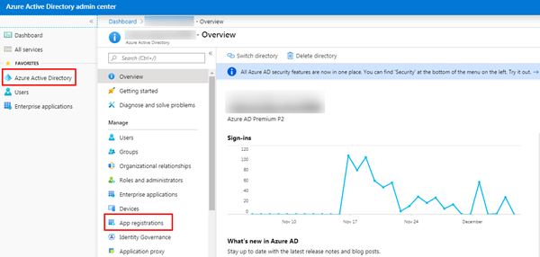
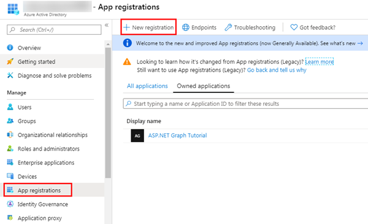
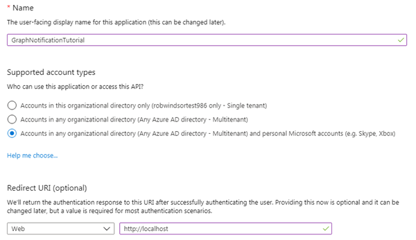
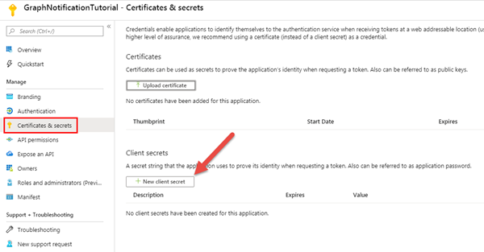
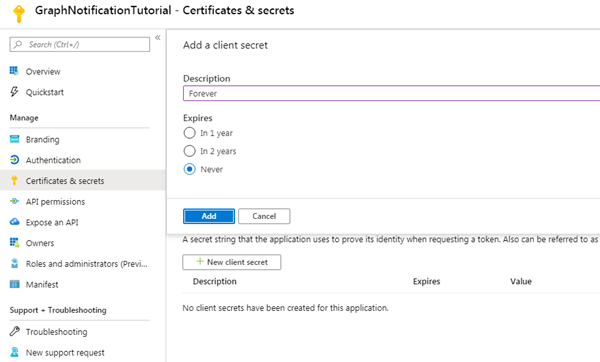
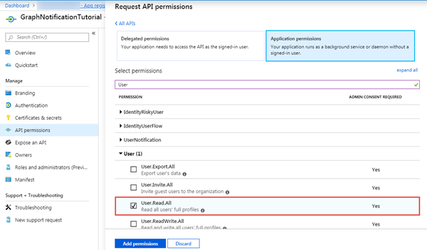

<!-- markdownlint-disable MD002 MD041 -->

In this exercise, you will create a new Azure AD web application registration using the Azure Active Directory admin center and grant administrator consent to the required permission scopes.

1. Open a browser and navigate to the [Azure Active Directory admin center (https://aad.portal.azure.com)](https://aad.portal.azure.com). Login using a **Work or School Account**.

1. Select **Azure Active Directory** in the left-hand navigation, then select **App registrations** under **Manage**.

    

1. Select **New registration**. On the **Register an application** page

    

    Set the values as follows:

    - **Name**: GraphNotificationTutorial
    - **Supported account types**: Accounts in any organizational directory and personal Microsoft accounts
    - **Redirect URI**: Web > http://localhost

    

    Select **Register**.

1. On the **GraphNotificationTutorial** page, copy the value of the **Application (client) ID** and **Directory (tenant) ID** save it, you will need them later in the tutorial.

    

1. Select **Manage > Certificates & secrets**. 

    Select **New client secret**.

    Enter a value in **Description** and select one of the options for **Expires** and select **Add**.

    

    

1. Copy the client secret value before you leave this page. You will need it later in the tutorial.

    > [!IMPORTANT]
    > This client secret is never shown again, so make sure you copy it now.

    

1. Select **Manage > API Permissions**.

    Select **Add a permission** and select **Microsoft Graph**.

    

    Select **Application Permission**, expand the **User** group and select **User.Read.All** scope.

    Select **Add permissions** to save your changes.

    

    

The application requests an application permission with the **User.Read.All** scope. This permission requires administrative consent.

Select **Grant admin consent for Contoso**, then select **Yes** to consent this application and grant the application access to your tenant using the scopes you specified.

